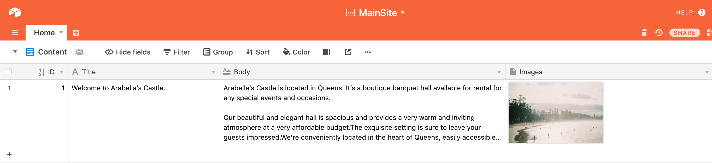

# Airgo

(Get it? Like _ergo_?)

Airgo is yet another static site generator. It is written with golang and backed with airtable. The primary design principles of this project are:

* Simplicity (ie: non complicated frontends intended to power small businesses or simple blogs)
* Ease of use (ie: data stored in airtable to simplify content management)
* Serverless (ie: builds trigged on Github Actions and artifacts published to Github Pages or [surge.sh](https://surge.sh/))

## Prerequisites 

Currently, this project is not intended to be imported as a package. In order to get set up with airgo, the following requirements are necessary:

* Docker
* docker-compose

## Getting Started

```bash
git clone git@github.com:mottaquikarim/airgo.git
cd airgo
```

First, clone the repo to your local environment and cd into the downloaded folder.

```bash
make develop
```

Running `make develop` will initialize a static file server in go for development purposes. Whenever template files, configs or the logic that converts data into HTML is changed, the server will "live restart" making development much easier / simpler.

```bash
make refresh arguments="-api-key=keyXXXXXXXw6 -base-id=appXXXXXXXoo"
```

Finally, run `make refresh` which will look up data from airtable and store it locally in the `data` folder. In order to make this step properly work, you will need to fetch your **API key** and **Base ID** from airtable.


## Core Concepts

Airgo works primarily through two main scripts representing two processes:

* `refresh_data`: This script will fetch content from airtable and save it locally.
* `site_builder`: This script will parse template files and build static HTML using template content and the locally saved data.

### Representing content

A single base in airtable represents a single **website**. Each table within a base represents a page on that site. The columns defined in a table represents individual datafields that can be referenced in the `templates` when rendering static html.

So for example, the following table:




Would be represented as a `template` file and each of the columns (`Title`, `Body`, `Images`) may be injected into a static html file like so:


Notice the `Home` link on the top left. The `config.json` file provides mappings for converting a table to a template. The "human readable" name of the template is defined in this config, like so:

```json
{
	"nav": [{
		"name": "Human Readable Name to show up on the website",
		"key": "Airtable table name",
		"filenameRoot": "the-name-of-the-html-file-to-be-generated"
	}],
}
```

## Fetching Data

To refresh data, Airgo leverages [go-airtable](https://github.com/mottaquikarim/go-airtable), which queries airtable and returns a `Record` struct representing the data. 

Particularly, the actual content from the tables are stored in `Record.Fields` which is a `map[string]interface`, allowing for great flexibility in managing the various datatypes supported by airtable.

This returned `Record` struct is marshaled into JSON and saved in the `data` folder. Airgo knows which tables to download from the `config.json` file defined at the project root.

## Building the Site

In order to generate the actual HTML pages, Airgo leverages the native golang `templates`package (more info [here](https://golang.org/pkg/text/template/)). Individual page templates are defined in the `templates` folder. Airgo supports partial templates bu leveraging golang's underlying template nesting features.

In order to generate a static html page, airgo looks at the files saved inside of the `data` folder from the previous (`refresh_data`) step and for each data file, attempts to pass the data along to a corresponding template defined in the `templates` folder. 

The `static` folder is the ultimate destination of the generated html files. The idea is any and all static content (CSS, javascript, etc) should go into the `static` folder. The templates defined will generate any additional HTML files that will be also saved into the `static` folder.

Ultimately, the content of the `static` folder will be published to Github Pages or surge.sh (or netlify, etc). 

## Usage

A few other make targets worth knowing:

```bash
make logs
```

This will display the app logs from within the docker container. This is especially useful for developing and debugging.

```bash
make fmt
```

This will format golang source code as appropriate.

```bash
make lint
```

This will run lint checks against the source code.

```bash
make test
```

This will run unit tests against source code.

## Contributing
Pull requests are welcome. For major changes, please open an issue first to discuss what you would like to change.

Please make sure to update tests as appropriate.

## License
[MIT](https://choosealicense.com/licenses/mit/)
